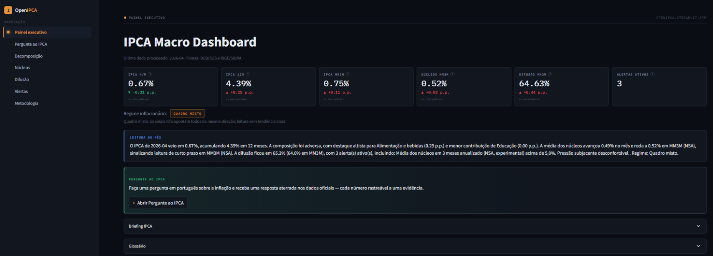

# OpenIPCA

**Brazilian inflation beyond the headline.**

[](https://github.com/Brunosavastano/OpenIPCA/actions/workflows/tests.yml)
[](LICENSE)
[](pyproject.toml)

**[➡️ Open the live app — openipca.streamlit.app](https://openipca.streamlit.app)**

[](https://openipca.streamlit.app)

OpenIPCA is an open-source macro research dashboard for Brazilian inflation. It turns
official data from **IBGE/SIDRA** and **BCB/SGS** into IPCA decomposition, core inflation,
diffusion and auditable alerts. The numbers are deterministic; the AI is **grounded** — it
*orchestrates* those numbers and every claim traces to an evidence item, never an invented
figure. Its most visible piece is **Ask the IPCA**: a grounded Q&A box that reasons about the
release in plain Portuguese, where every number traces to an evidence id. It answers live and
falls back to audited, pre-generated answers, so a grounded reply is always there.

> 🇧🇷 Leia em português: [README.pt-BR.md](README.pt-BR.md)

---

## ⚠️ Disclaimer

OpenIPCA is a research and education tool. It uses public data sources and deterministic
calculations to support inflation analysis. It is **not investment advice**, does **not**
provide monetary-policy forecasts, and **may contain errors**. It is **not affiliated with,
endorsed by, or connected to the IBGE or the Banco Central do Brasil** — it only consumes
their public data. Always verify critical analysis against the official sources.

---

## Why this exists

The headline IPCA number doesn't tell the whole story. A single month can hide whether
inflation is *broad or concentrated*, whether *cores* are benign or pressured, and whether
*momentum* is accelerating. OpenIPCA reconstructs the release the way a macro research desk
would read it — decomposition, cores, diffusion and momentum — from official data, with the
methodology fully in the open.

## Features

- **Ask the IPCA** — a grounded Q&A box where *every number traces to an evidence id*. Ask in
  Portuguese and get an answer anchored in the official data; it answers live and falls back to
  audited, pre-generated answers, so a grounded reply is always there. It reasons
  about the release, confronts external hypotheses ("did an oil shock cause
  this?") against the numbers, refuses prompt-injection, and never gives investment advice or
  Copom/Selic forecasts.
- **Decomposition** of IPCA by group, subgroup, item and subitem (contributions in p.p.).
- **Core inflation** monitor with configurable presets (`config/core_sets.yaml`).
- **Diffusion** (official BCB series + a calculated breakdown by group).
- **Auditable alerts** from declarative rules (`config/alert_rules.yaml`).
- **Deterministic macro brief** + inflation-regime classification.
- **Optional AI layer** (off by default, BYOK): a grounded, auditable brief — every claim
  cites an evidence id; no AI-generated numbers.
- **Validation & audit** reports so you can tell what's official, calculated or approximate.

## Quickstart

```bash
python -m venv .venv
# Windows (PowerShell):  .venv\Scripts\Activate.ps1
# macOS / Linux:         source .venv/bin/activate
python -m pip install --upgrade pip
python -m pip install -e ".[dev]"

# Fetch official data and build the processed datasets:
python -m ipca_dashboard.pipeline run --start 2020-01

# Launch the dashboard:
streamlit run dashboard/app.py
```

Run the test suite with `python -m pytest`.

## Data sources

- **BCB/SGS** — IPCA headline, macro aggregates, cores and official diffusion.
- **IBGE/SIDRA table 7060** — weights, variations and the group → subitem hierarchy.

No fictitious data is ever used as a fallback: if an API is unavailable, the app fails
explicitly. See [methodology.md](methodology.md) for formulas and limitations.

## AI layer (optional)

The app works **fully without AI**. The AI layer is **disabled by default** and uses
**BYOK** (bring your own key) — no keys are stored in the repo. When enabled, the model
*orchestrates* deterministic tools and an evidence table; it never invents numbers, and
every claim is validated against an existing evidence id. See [SECURITY.md](SECURITY.md)
for key handling.

It is **model-agnostic** (OpenAI, Anthropic or Google Gemini behind one provider seam — the
model is config, not code) and the safety floor is code: guardrails reject prompt-injection
and off-scope questions *before* the model, and reject ungrounded numbers, monetary-policy
forecasts and asset advice *after* it. **Ask the IPCA**'s answers are grounded and audited —
every number traces to an evidence id; it answers live on a free model, with pre-generated
audited answers as an always-on fallback so a grounded answer is always visible. Run it locally
with your own key for unrestricted live Q&A.

### How the AI works

1. **The AI orchestrates deterministic tools** — it calls typed functions
   (`get_headline`, `get_contributions`, `get_diffusion`, …) over the processed official
   data; it never receives free-form text to paraphrase and never computes a number itself.
2. **Every claim traces to an evidence id** — each tool returns values wrapped in an
   evidence table; a claim that doesn't cite an existing `evidence_id` is rejected.
3. **Guardrails fail closed** — ungrounded numbers, monetary-policy forecasts and
   prompt-injection are blocked in code; on any failure the app degrades to the
   deterministic brief instead of guessing.
4. **Public answers are audited replays** — the monthly brief and the curated Q&A answers
   are generated once, validated, committed with model/prompt/evidence hashes
   ([reports/latest/](reports/latest/)) and refreshed in lockstep with the data.

Key handling and deployment details: [DEPLOY.md](DEPLOY.md).

## Contributing

Issues and PRs are welcome. Please don't commit API keys — CI enforces this via
`scripts/check_no_secrets.py`. See [SECURITY.md](SECURITY.md).

## License

[MIT](LICENSE) © 2026 Bruno Savastano
